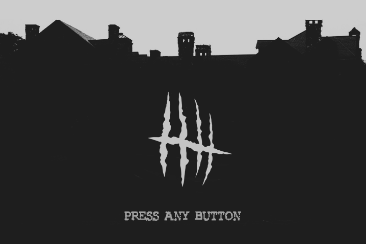
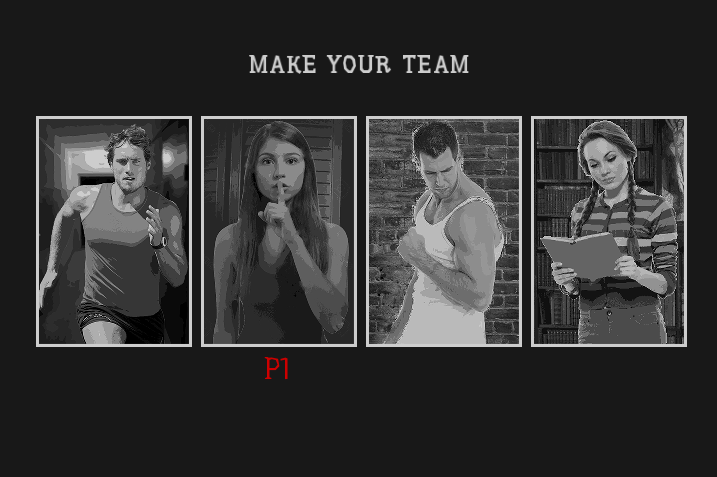
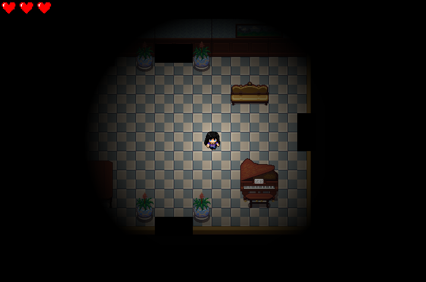
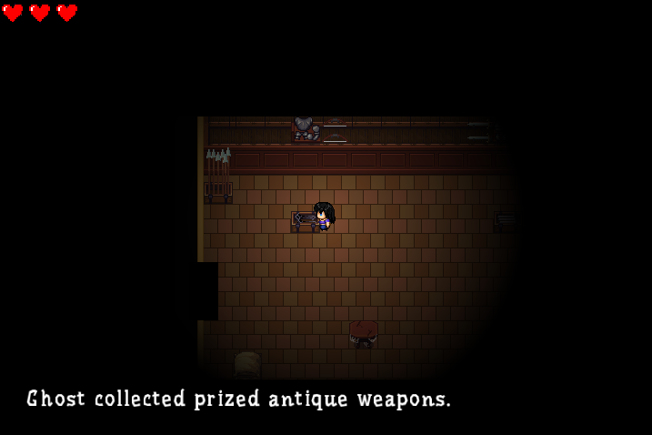
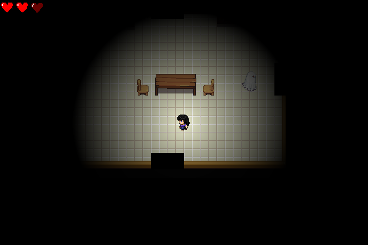
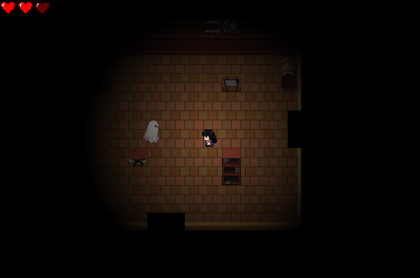

# House Haunters


Hunt or be Haunted

# Running
SFML required.

```
git clone
cd HouseHaunters
mkdir Debug
cd Debug

cmake
make
./HH
```

# Screenshots

To see a demo with multiplayer, [click here](https://www.youtube.com/watch?time_continue=13&v=iWgVyEbL8hM).

Start page


Choose one of four characters, each with their own unique ability.


The Brother: speed. extra speed while running
The Sister: stealth. when character is still, the ghost doesn't detect her
The Father: strength. one extra life to fight the ghost
The Mother: smarts. sees more specific clues than the others

Explore the 23 different room designs


Find clues to defeat the ghost


Fight (or flee) the ghost



# Controls

Up to 4 controllers supported (including keyboard).

The controls below refer to a PS4 controller setup (not tested with any other controller type) and a standard keyboard setup.

Move - Arrow Keys / D-pad  
Interact/Read Clue - Z / X button  
Attack - X / Circle  
Run(Brother only) - C / Square  
Sacrifice yourself to the haunting entity and witness the meaning of death - V / Triangle
